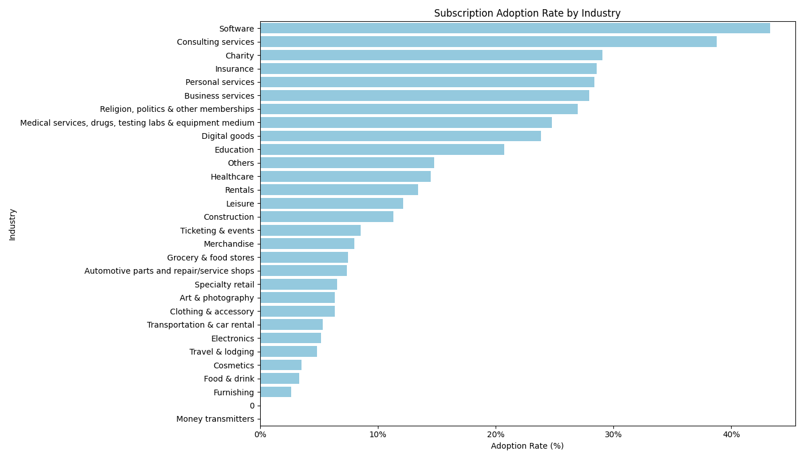
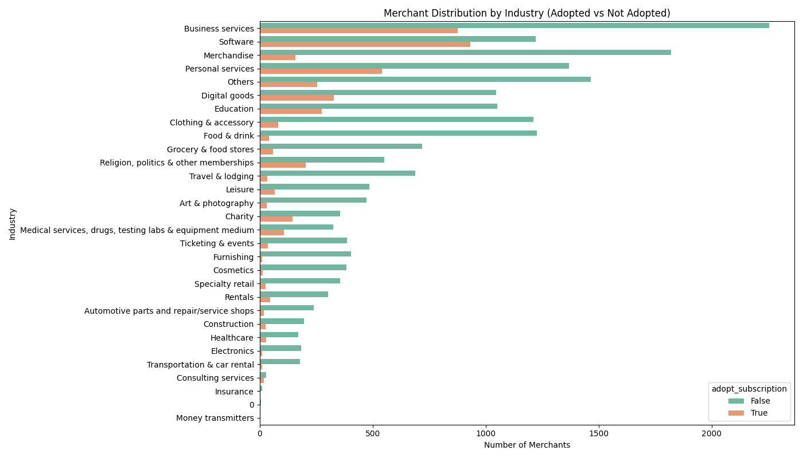
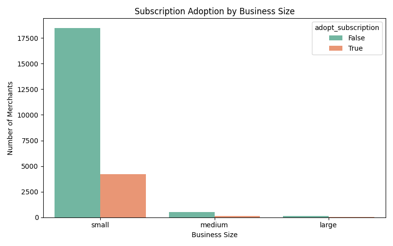
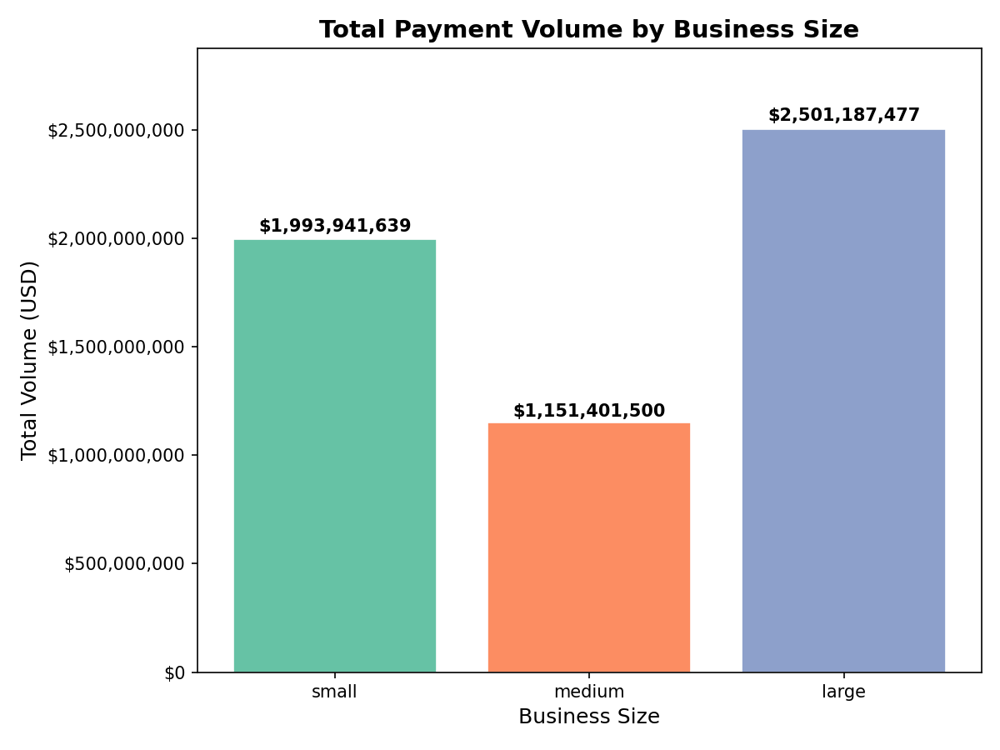

# Identifying Subscription Upsell Candidates via Seasonality Detection

## Approach

I used time series analysis to find non-subscriber merchants whose payment volumes repeat on a regular schedule (weekly, biweekly, monthly, etc.). If a merchant's customers are already paying on a predictable cycle, Subscriptions is a natural next step to automate what's already happening.

## Data Preparation

1. **Scoped to non-subscribers only.** Filtered to merchants with zero subscription volume, since these are the upsell targets.
2. **Minimum 30 active days.** Seasonality detection requires sufficient observations. This left 6,694 merchants.
3. **Gap-filled daily time series.** For each merchant, reindexed daily Checkout + Payment Link volumes onto the full calendar date range, filling missing days with zero. Autocorrelation requires evenly-spaced data.

## Methodology

Each merchant was scored using **autocorrelation (ACF)** at five candidate lags (7, 14, 30, 60, 91 days). This checks whether a merchant's volume on a given day looks similar to their volume *N* days later. High ACF at lag 7 means the pattern repeats weekly.

The seasonality score is the highest ACF value across the five candidate lags. ACF is used as the sole scoring signal because it handles real-world patterns well (e.g., sharp weekly spikes followed by quiet days) and directly answers whether a merchant's volume repeats on a fixed schedule.

## Results

**Top 500 merchants** were ranked by seasonality score.

### Cycle type breakdown

| Cycle     | Count | Share |
|-----------|-------|-------|
| Weekly    | 372   | 74%   |
| Biweekly  | 95    | 19%   |
| Monthly   | 21    | 4%    |
| Quarterly | 8     | 2%    |
| Bimonthly | 4     | 1%    |

### Which merchants to target

Starting from the candidates with highest score. These have very clear repeating patterns. The top-ranked merchant (`01f9bf03`) has an ACF of 0.925 at lag 7, meaning each week's volume is 88% correlated with the prior week's, in ,particular for `01f9bf03`, every Monday.

## Evaluation

- **Visual validation.** I plotted the top 5 merchants (time series, ACF) and confirmed the detected patterns are real.

- **Statistical significance.** ACF values exceed the 95% confidence bound (±1.96/√n).

## Recommendation for Stripe

1. **Sales prioritization.** Use the ranked list to prioritize outreach. These are low-hanging fruit.
2. **In-product integration.** Surface the detected cycle in the Stripe Dashboard ("Your customers tend to pay every week. Set up a subscription to automate this.") as a contextual upsell prompt.
3. **Segment by cycle type.** For a more precise promotion, tailor the Subscriptions pitch to the detected cadence: weekly merchants hear about success story of weekly billing plans; monthly merchants hear about success story of weekly billing plans. If time and resources permit, a industry-oriented or a nearest neighbor (via clustering) success story can be used to target the merchant.

## Next Steps with More Resources

### Key observation from exploratory analysis

Software (~44%) and Consulting services (~39%) have the highest subscription adoption rates by a wide margin (see chart below), likely because their teams have the technical background to evaluate and set up recurring billing. Meanwhile, industries with far more merchants — Business services, Merchandise, Personal services — have large non-adopter populations despite moderate adoption rates (~28%, ~8%, ~28% respectively), representing a substantial untapped opportunity.

### Strategy 1: Precise marketing — close the small-business gap

Small businesses make up the overwhelming majority of the merchant base (~18k non-adopters vs ~4k adopters), yet their collective payment volume (~$2B) rivals that of large businesses (~$2.5B). Converting even a fraction of these non-adopters would meaningfully grow the Subscriptions business while deepening merchant relationships and reducing churn to competitors.

Concrete actions:

- **Learn from small-business adopters.** Interview small merchants who already use Subscriptions across each industry vertical. Document what motivated them, how they set it up, and what benefits they see — then package these as industry-specific case studies and success stories.
- **Understand non-adopter barriers.** Survey or interview small non-adopters to identify friction points: is it awareness, perceived complexity, pricing concerns, or something else?
- **Lower the setup barrier.** Produce step-by-step onboarding guides and video walkthroughs tailored to merchants without technical backgrounds, so that adoption doesn't require a developer.
- **Targeted campaigns.** Use the seasonality-scored candidate list alongside industry and business-size segmentation to run precise outreach — e.g., a Food & drink small merchant with a strong weekly cycle receives a pitch showing how a similar café automated weekly billing.

### Strategy 2: Mass promotion — raise awareness

A likely reason many merchants have not adopted Subscriptions is simply that they are unaware of the product or unsure whether it applies to their business. Broad-reach campaigns can address this:

- **In-product notifications.** Surface contextual prompts in the Stripe Dashboard for merchants whose transaction patterns suggest a fit (e.g., "You receive payments on a weekly cycle — automate this with Subscriptions").
- **Email campaigns with promotional incentives.** Send targeted emails to non-adopters, segmented by industry and cycle type, with introductory offers (e.g., waived fees for the first month) to reduce the barrier to trial.
- **Educational content.** Publish blog posts, webinars, and documentation that explain Subscriptions benefits in terms each industry understands, making the value proposition concrete rather than generic.
